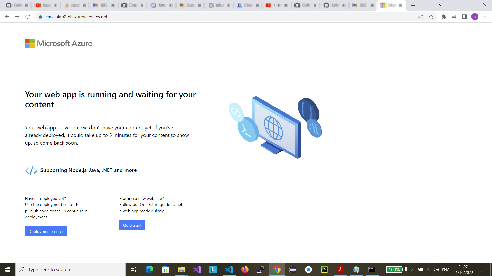
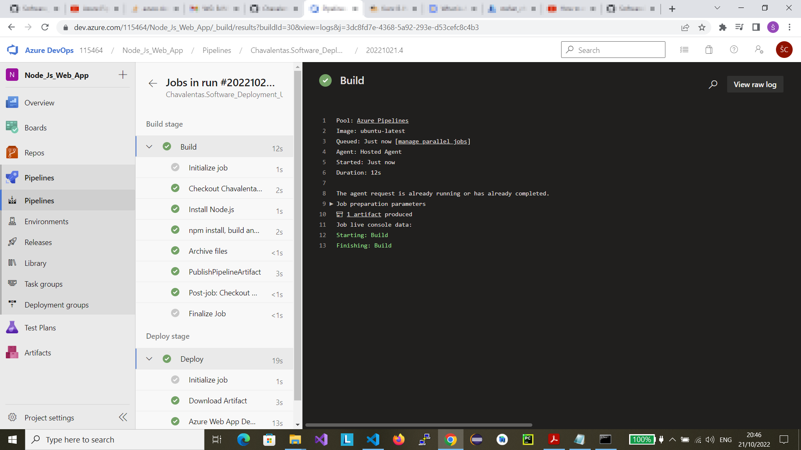
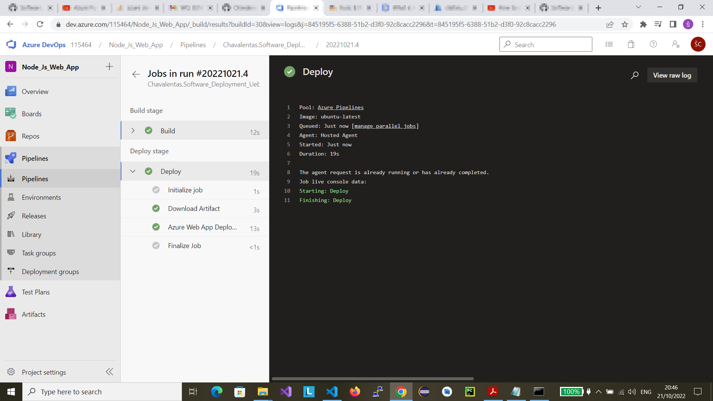
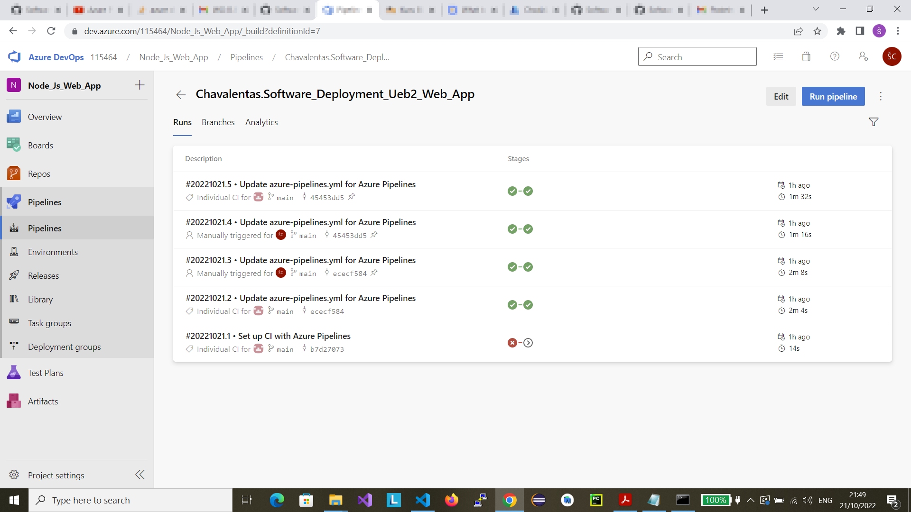
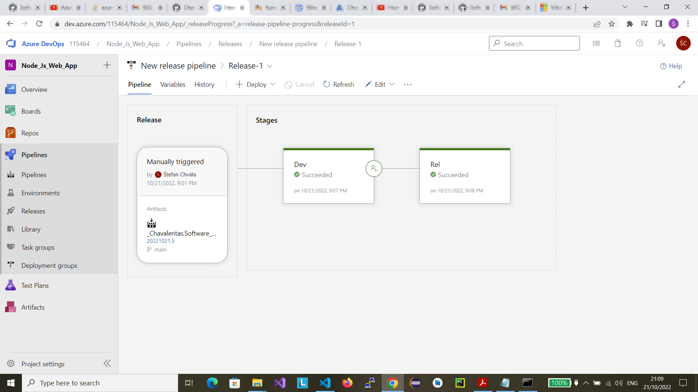
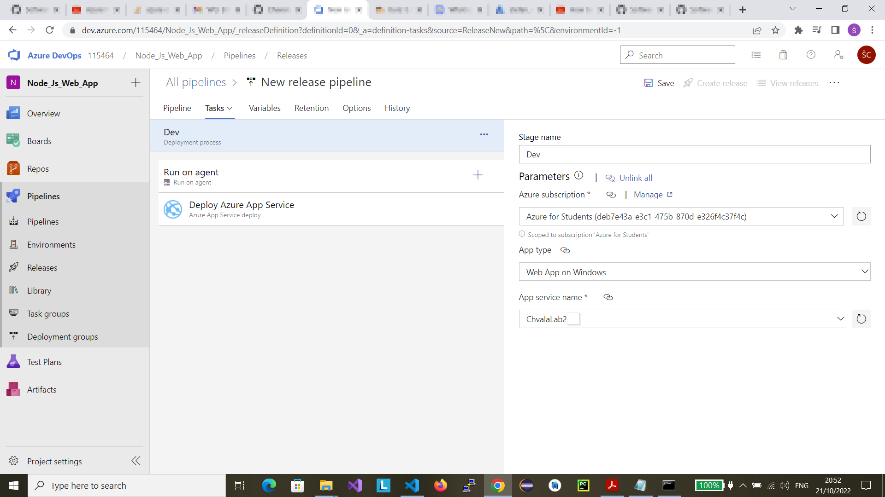
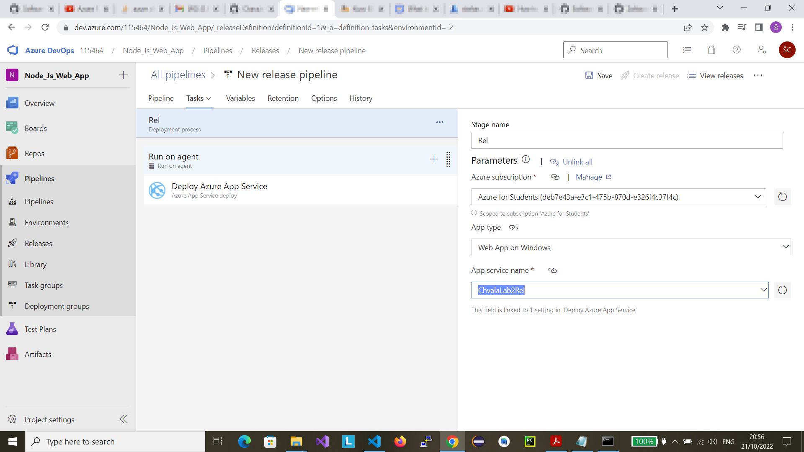
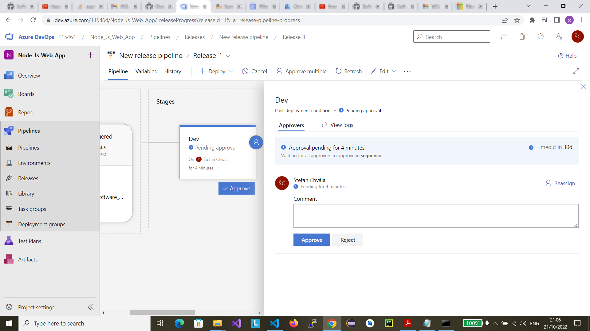
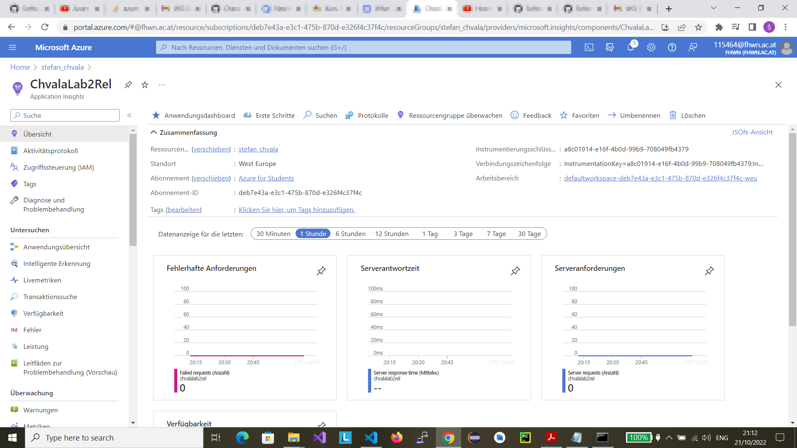

# Lab 2
The following document describes my approach to the task.
The web application is a demonstrative REST-API that manipulates an object array.
The unit tests were made with Mocha and Chai.

## Links I used to solve the task
* https://www.youtube.com/watch?v=ob4UER3wfp8
* https://www.youtube.com/watch?v=xDI2KK2gSgQ
* https://dev.to/mhmdlotfy96/testing-a-rest-api-in-node-js-with-express-using-mocha-and-chai-1258
* https://www.youtube.com/watch?v=8sFTdzz55KU
* https://www.youtube.com/watch?v=BAFCiiOAXB8

## Link to the web application repository
* https://github.com/Chavalentas/Software_Deployment_Ueb2_Web_App

## Links to the applications
* Development (Stage 1): https://chvalalab2.azurewebsites.net
* Production (Release) (Stage 2): https://chvalalab2rel.azurewebsites.net

## Build

Here is a screenshot of the build:

## Deploy

Here is a screenshot of the deploy:

## Successful and unsuccessful builds and deployments

Here is a screenshot containing the unsuccessful and successful builds and deployments:

## Release pipeline

Here is a screenshot of the release pipeline:

## Documentation of the release procedure

After you create a successful build and deployment, you can proceed with the creation of a new release.
At first, you have to create a development stage:

Afterwards, you have to create a production (release) stage:

It can be seen in the screenshots that both stages need separate app services.
Stage 1 (Development) has the app service called **ChvalaLab2**.
Stage 2 (Release) has the app service called **ChvalaLab2Rel**.
The release is manually triggered by approving it.

## Application insights
The following screenshots contain the insights of the both services: **ChvalaLab2** and **ChvalaLab2Rel**.

## Experience 
The task was definitely more challenging than the first one.
The first problem I was struggling with was the visibility of the Azure DevOps project.
If you create a public project, you have to send a Azure DevOps Parallelism Request to Microsoft.
This is accoding to Microsoft due to the auto-mitigations against crypto-mining abuse.
Microsoft has disabled the free grant of parallel jobs for public projects and for certain private projects in new organizations.
The problem can be found [here](https://developercommunity.visualstudio.com/t/parallelism-request-for-running-a-pipeline/1684569).
Since I did not want to wait for a response of the request (which would take from 2 to 3 days), I wanted to find another solution to this problem.
It took a me while to realize that I have to create a private project.
I confused the visibility of the project with the visiblity of the repository.
It is not the same!
Another problem I encountered was the deployment of the app.
I wanted to use the **Node.js Express Web App to Linux on Azure** template for the creation
of the **azure-pipelines.yml** file.
This template is specified for the Linux application.
Since you can only use Windows version of the application service in the free tier storage in Azure,
you have to use the correct version of the OS in the **azure-pipelines.yml** file.
This is by changing the value of the attribute **appType** from **webAppLinux** to **webApp**.
At first, the pipeline did not want to deploy the application because I create a Windows app service
in Azure (since Linux version has monthly fees).
This was because the script in **azure-pipelines.yml** was aiming at a Linux version and it found
a Windows version in my Azure resource.
I did not encounter any problems during the creation of the release pipeline.