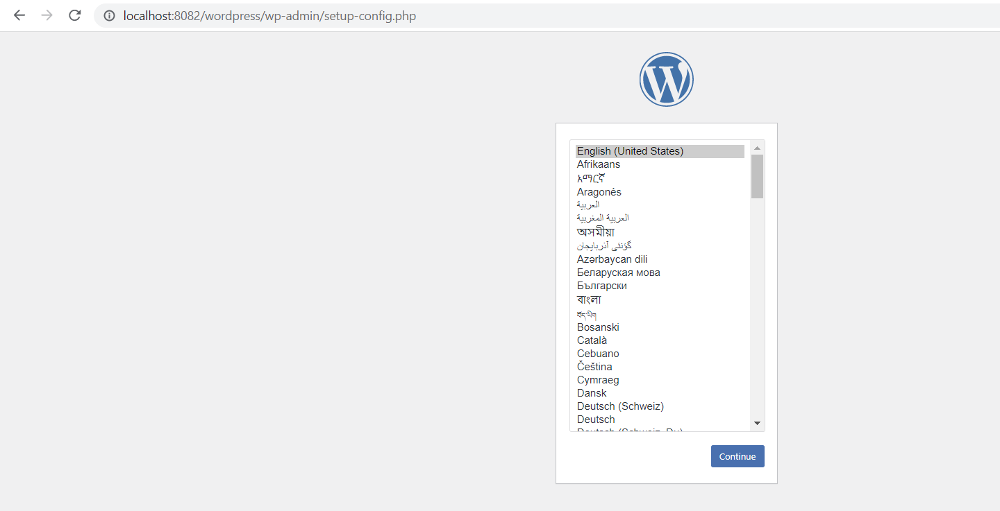
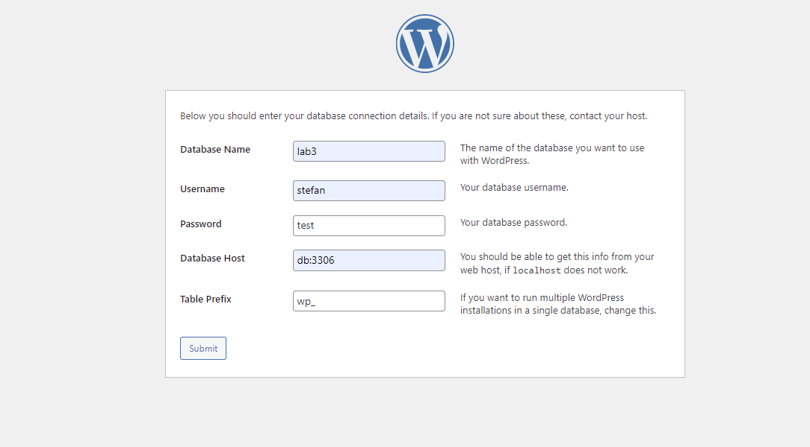
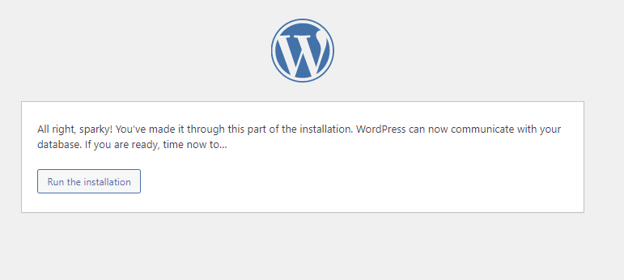
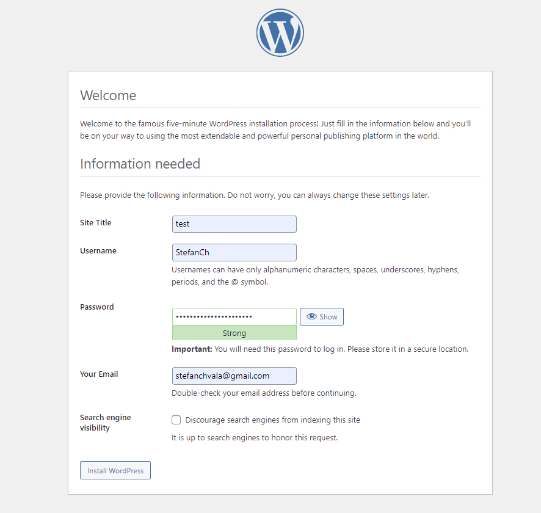
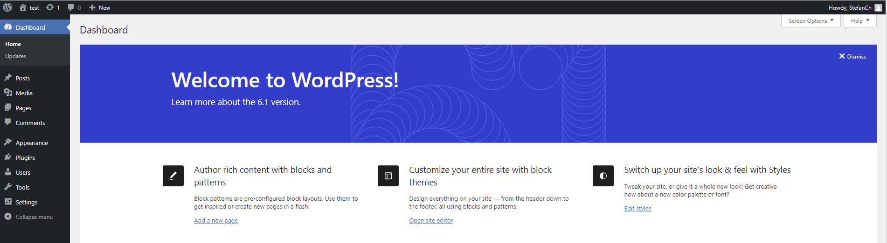

# Lab 3

## Teil 1
The image was created with the reference to the following [link](https://gist.github.com/bradtraversy/faa8de544c62eef3f31de406982f1d42) with few adaptations
to the task.
In order to run the containers, navigate to the Teil1 folder and execute the following:
```
docker-compose up -d
```
Enter **http://localhost:80** in the browser und you can see the select language page of Wordpress.
Afterwards, execute the following:
```
docker-compose down -v
```
Delete the created images (**mysql** and **wordpress**) in your Docker Desktop application in order to avoid conflicts with the second task.

## Teil 2
**NOTE:** It is not necessary to build these images separately, you simply call **docker-compose up -d** in the folder Teil2 and the 
images will be built automatically during the execution.
### MySQL
The dockerfile was created using the following [tutorial](https://www.digitalocean.com/community/tutorials/how-to-install-linux-apache-mysql-php-lamp-stack-on-ubuntu-16-04) (Step 2 — Installing MySQL).
In order to ensure that the server can be accessed remotely, I used the following [tutorial](https://www.digitalocean.com/community/tutorials/how-to-allow-remote-access-to-mysql).
During the initiation, the server creates a table users and grants privileges to the user of the database.
The image can be built by navigating to the MySQL folder and executing the following:
```
docker build -t <yourusername>/testmysql
```

### Wordpress
The LAMP part was created with the reference to this [tutorial](https://www.digitalocean.com/community/tutorials/how-to-install-linux-apache-mysql-php-lamp-stack-on-ubuntu-16-04).
The Wordpress extension was added using this [tutorial](https://www.vpsserver.com/community/tutorials/30/installing-wordpress-on-debian-8-server/).
The image can be built by navigating to the Wordpress folder and executing the following:

```
docker build -t <yourusername>/testwordpress
```

### docker-compose.yml
The file was created with the reference to the following [link](https://gist.github.com/bradtraversy/faa8de544c62eef3f31de406982f1d42) with few adaptations
to the task.
To build the containers run:
```
docker-compose up -d
```
Enter **http://localhost:8082/wordpress** in the browser und you can see the select language page of Wordpress.
Enter the database credentials specified in the [MySQL docker file](https://github.com/Chavalentas/Software_Deployment/tree/main/Lab3/Teil2/MySQL). Create your website and log in to your created website.
Here are some screeshots of the setup:





Afterwards, execute the following:
```
docker-compose down -v
```
Delete the created images in your Docker Desktop application in order to avoid conflicts with the first task
(in case you want to do the first task again).

## Experience
The first problem I encountered was the fact that I was prompted during the installation of the packages.
This aborted the building of the images.
To resolve this problem, I added the parameter **-y** to every installation (answers automatically yes to every prompt).
The installation of MySQL in the second part was problematic because I was prompted to enter the root password.
Again, this aborted the building of the image.
I used this [tutorial](https://www.youtube.com/watch?v=UpJ6d9b6NaM) to suppress the prompts.
This required me to store the data (this would be normally stored using the user input) in the environment variables.
The last problem I encountered was running the **docker-compose.yml** in the second part.
I could not connect to the database in the UI of Wordpress.
Adding **WORDPRESS_DB_HOST: db:3306** to the environment in the service wordpress solved this issue.
