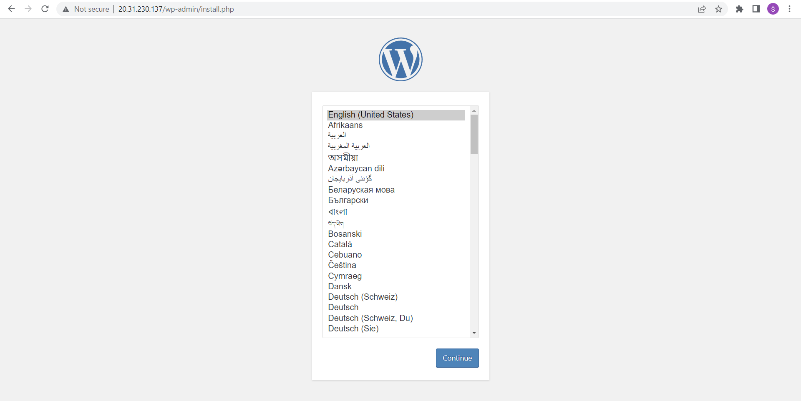

# Lab 4
**NOTE:** In order to reduce the costs associated with Kubernetes, I stopped the container.
This means that the IP address mentioned below will not work.
In order to start the AKS cluster again, follow the relevant section below in this tutorial.
Please note that the IP address may change after you start the cluster again.
It is also important to wait 15-30 minutes between stopping and starting the service.
If you start the service sooner, it may result in errors.

## Steps to deploy
1. Log in to Azure account using **az login**.
2. Call **az provider show -n Microsoft.OperationsManagement -o table**
and **az provider show -n Microsoft.OperationalInsights -o table** to check if these resource providers are registered.
If not call **az provider register --namespace Microsoft.OperationsManagement** or
**az provider register --namespace Microsoft.OperationalInsights**.
3. Create resource group using **az group create --name kubernetestest  --location westeurope**.
4. Create AKS cluster using **az aks create -g kubernetestest -n testcluster --enable-managed-identity --node-count 1 --enable-addons monitoring --enable-msi-auth-for-monitoring --generate-ssh-keys**.
5. Install the kubectl using **az aks install-cli**.
6. To ensure the 'kubelogin.exe' can be found run **$env:path += '<path to .azure-kubelogin'**.
7. Run **az aks get-credentials --resource-group kubernetestest --name testcluster** to configure kubectl to connect to the cluster.
8. Run **kubectl get nodes** to ensure you are connected to the cluster.
9. Create MySQL password using **kubectl create secret generic mysql-pass --from-literal=password=test**.
10. Create the files **mysql-deployment.yaml** and **wordpress-deployment.yaml** using this [link](https://kubernetes.io/docs/tutorials/stateful-application/mysql-wordpress-persistent-volume/).
11. Navigate to the folder, where you created **mysql-deployment.yaml** and **wordpress-deployment.yaml**.
12. Run **kubectl apply -f mysql-deployment.yaml** and **kubectl apply -f wordpress-deployment.yaml**.
13. Run **kubectl get service wordpress --watch** to watch the wordpress service.
14. Called the assigned external IP in the browser (20.31.230.137 in my case).

See more screenshots in the Screenshots folder.

## IP address of the service
* 20.31.230.137

## Stop the AKS
1. Run **az aks stop --name testcluster --resource-group kubernetestest**.
2. Verify that the service stopped using **az aks show --resource-group kubernetestest --name testcluster**.

## Start the AKS
1. Run **az aks start --name testcluster --resource-group kubernetestest**.

## Helpful links
* https://learn.microsoft.com/en-us/azure/aks/learn/quick-kubernetes-deploy-cli
* https://kubernetes.io/docs/tasks/configmap-secret/managing-secret-using-kubectl/
* https://learn.microsoft.com/en-us/azure/aks/start-stop-cluster?tabs=azure-cli
* https://kubernetes.io/docs/tutorials/stateful-application/mysql-wordpress-persistent-volume/